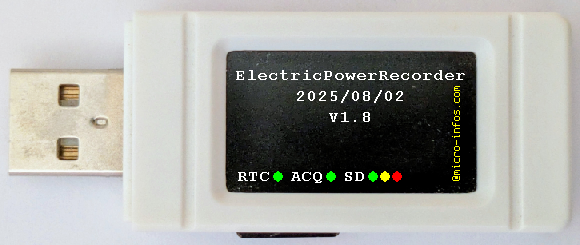
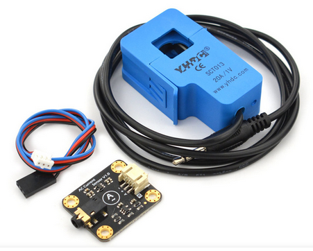

# ElectricPowerRecorder

Projet basé sur une clé USB [ESP32-S3-GEEK](https://www.waveshare.com/wiki/ESP32-S3-GEEK) de la Société [Waveshare](https://github.com/waveshareteam) 

## 🛄 Matériels supplémentaires utilisés
1. Capteur de courant AC 20A/1V SEN0211 (marquage SCT013 de la Société YHDC)
2. Connecteur JST-SH1.0 femelle 4 broches pour l'alimentation en 3V3 + GND du convertisseur AC/DC + entrée analogique pour les connexions à l'ESP32-S3-GEEK
3. Convertisseur AC/DC avec son câble d'interface de 3 broches (3V3, GND et sortie analogique reliés respectivement au 3V3, GND et SDA16 du connecteur **I2C** de l'ESP32-S3-GEEK - les 2 autres connecteurs **UART** et **GPIO** étant inutilisés)

## 🛠️ Environnement de développement
Arduino IDE 2.3.2 + package pour ESP32
(https://espressif.github.io/arduino-esp32/package_esp32_index.json)

## Présentation sur 24 heures de fonctionnement
[Vidéo](https://youtu.be/y9ntpcjDOnc)
