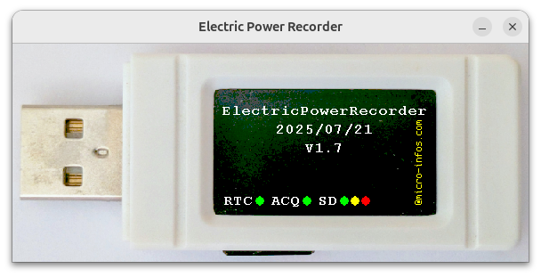

# ElectricPowerRecorder

Projet basé sur une clé USB [ESP32-S3-GEEK](https://www.waveshare.com/wiki/ESP32-S3-GEEK) de la Société [Waveshare](https://github.com/waveshareteam) 

## 🛄 Matériels supplémentaires utilisés
1. Capteur de courant AC 20A/1V SEN0211 (marquage SCT013 de la Société YHDC)
2. Convertisseur AC/DC
3. Connecteur JST-SH1.0 femelle 4 broches pour l'alimentation en 3V3 + Masse du convertisseur AC/DC + Acquisition analogique

## 🛠️ Environnement de développement
Arduino IDE 2.3.2 + package pour ESP32
(https://espressif.github.io/arduino-esp32/package_esp32_index.json)
